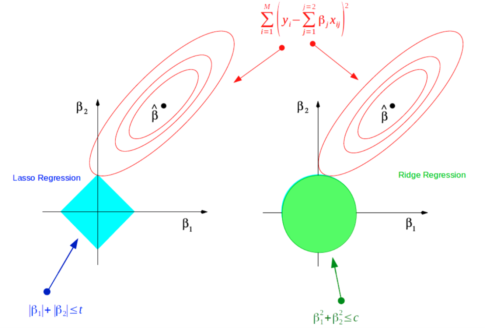

## Introduction

Bayesian inference is based on updating beliefs:

$$
p(\theta \mid x) = \frac{p(x \mid \theta)\, p(\theta)}{p(x)}
$$

- Likelihood = information from data
- Prior = information before data
- Posterior = updated belief

------------------------------------------------------------------------

## Likelihood Example

Suppose $X \sim \text{Binomial}(n,\theta)$
```{r}
n <- 10
x <- 7
theta <- seq(0, 1, length = 200)
likelihood <- dbinom(x, n, theta)
plot(theta, likelihood,
     type = "l", lwd = 2,
     main = "Likelihood Function",
     xlab = "theta", ylab = "L(theta)")
```

------------------------------------------------------------------------

## Adding a Prior

Assume a Beta prior: $\theta \sim \text{Beta}(2,2)$
```{r}
prior_a <- 2
prior_b <- 2
prior <- dbeta(theta, prior_a, prior_b)
plot(theta, prior,
     type = "l", lwd = 2,
     main = "Prior Distribution",
     xlab = "theta", ylab = "Density")
```

------------------------------------------------------------------------

## Posterior Distribution

Using conjugacy: $\theta \mid x \sim \text{Beta}(2 + x,\; 2 + n - x)$
```{r}
posterior <- dbeta(theta, prior_a + x, prior_b + n - x)
plot(theta, posterior,
     type = "l", lwd = 2,
     main = "Posterior Distribution",
     xlab = "theta", ylab = "Density")
```


------------------------------------------------------------------------

## Likelihood Example

Suppose $X \sim \text{Binomial}(n,\theta)$
```{r}
n <- 10
x <- 7
theta <- seq(0, 1, length = 200)
likelihood <- dbinom(x, n, theta)
plot(theta, likelihood,
     type = "l", lwd = 2,
     main = "Likelihood Function",
     xlab = "theta", ylab = "L(theta)")
```

------------------------------------------------------------------------

## Adding a Prior
Assume a Beta prior: $\theta \sim \text{Beta}(2,2)$
```{r}
prior_a <- 2
prior_b <- 2
prior <- dbeta(theta, prior_a, prior_b)
plot(theta, prior,
     type = "l", lwd = 2,
     main = "Prior Distribution",
     xlab = "theta", ylab = "Density")
```

------------------------------------------------------------------------

## Posterior Distribution
Using conjugacy: $\theta \mid x \sim \text{Beta}(2 + x,\; 2 + n - x)$
```{r}
posterior <- dbeta(theta, prior_a + x, prior_b + n - x)
plot(theta, posterior,
     type = "l", lwd = 2,
     main = "Posterior Distribution",
     xlab = "theta", ylab = "Density")
```

------------------------------------------------------------------------

## Updating the Posterior with New Data

*Simulate coin flips and watch the posterior update in real time.*

<div class="ojs-two-col">
```{ojs}
//| echo: false
viewof priorParams = Inputs.form([
  Inputs.range([0.5, 10], {value: 2, step: 0.5, label: "Prior α (Beta)"}),
  Inputs.range([0.5, 10], {value: 2, step: 0.5, label: "Prior β (Beta)"})
])

viewof trueP = Inputs.range([0, 1], {value: 0.5, step: 0.05, label: "True p"})

viewof coinData = {
  let heads = 0
  let total = 0

  const flipBtn = html`<button style="margin:4px 8px 4px 0; padding:6px 14px; font-size:1em;">🪙 Flip Coin</button>`
  const resetBtn = html`<button style="margin:4px 0; padding:6px 14px; font-size:1em;">↺ Reset</button>`
  const status = html`<div style="margin-top:8px; font-size:0.95em;">Flips: 0 | Heads: 0</div>`
  const container = html`<div>${flipBtn}${resetBtn}${status}</div>`

  const dispatch = () => {
    status.textContent = `Flips: ${total} | Heads: ${heads}`
    container.value = { heads, total }
    container.dispatchEvent(new CustomEvent("input"))
  }

  flipBtn.onclick = () => {
    const flip = Math.random() < trueP ? 1 : 0
    total += 1
    heads += flip
    dispatch()
  }

  resetBtn.onclick = () => {
    heads = 0
    total = 0
    dispatch()
  }

  container.value = { heads, total }
  return container
}
```
```{ojs}
//| echo: false
prior_a = priorParams[0]
prior_b = priorParams[1]
n_obs   = coinData.total
x_obs   = coinData.heads
post_a  = prior_a + x_obs
post_b  = prior_b + (n_obs - x_obs)
theta   = Array.from({length: 300}, (_, i) => i / 299)

function betaPDF(theta, a, b) {
  function lgamma(x) {
    const c = [76.18009172947146,-86.50532032941677,24.01409824083091,
               -1.231739572450155,0.1208650973866179e-2,-0.5395239384953e-5];
    let y = x, tmp = x + 5.5;
    tmp -= (x + 0.5) * Math.log(tmp);
    let ser = 1.000000000190015;
    for (let j = 0; j < 6; j++) ser += c[j] / ++y;
    return -tmp + Math.log(2.5066282746310005 * ser / x);
  }
  const logB = lgamma(a) + lgamma(b) - lgamma(a + b);
  return Math.exp((a - 1) * Math.log(theta) + (b - 1) * Math.log(1 - theta) - logB);
}

priorCurve = theta.slice(1, -1).map(t => ({theta: t, density: betaPDF(t, prior_a, prior_b), curve: "Prior"}))
postCurve  = theta.slice(1, -1).map(t => ({theta: t, density: betaPDF(t, post_a,  post_b),  curve: "Posterior"}))
allCurves  = [...priorCurve, ...postCurve]

Plot.plot({
  width: 600,
  height: 600,
  marginLeft: 50,
  style: { fontSize: "24px" },
  x: {label: "θ", domain: [0, 1], labelOffset: 36},
  y: {label: "Density", nice: true},
  color: {
    legend: true,
    domain: ["Prior", "Posterior"],
    range: ["#7bafd4", "#e07b54"],
    swatchWidth: 30,
    swatchHeight: 18,
    style: {fontSize: "18px"}
  },
  marks: [
    Plot.lineY(allCurves, {x: "theta", y: "density", stroke: "curve", strokeWidth: 6.5}),
    Plot.ruleY([0]),
    Plot.ruleX([trueP], {stroke: "black", strokeWidth: 3, strokeDasharray: "6,4"}),
    <!-- Plot.ruleX(n_obs > 0 ? [x_obs / n_obs] : [], {stroke: "steelblue", strokeWidth: 3, strokeDasharray: "6,4"}) -->
  ],
  caption: `Flips: ${n_obs}  |  Heads: ${x_obs}  |  Posterior: Beta(${post_a}, ${post_b})  |  Mean = ${(post_a / (post_a + post_b)).toFixed(3)}`
})
```

</div>

------------------------------------------------------------------------

## Posterior Summary Table
```{r}
library(knitr)
posterior_mean <- (prior_a + x) / (prior_a + prior_b + n)
posterior_var  <- (prior_a + x) * (prior_b + n - x) /
  ((prior_a + prior_b + n)^2 * (prior_a + prior_b + n + 1))
results <- data.frame(
  Quantity = c("Posterior Mean", "Posterior Variance"),
  Value    = c(posterior_mean, posterior_var)
)
kable(results, digits = 4)
```

------------------------------------------------------------------------

## Multi-level Model (Random Intercept)

Hierarchical data structure:

$$y_{ij} = \alpha + u_j + \epsilon_{ij}$$
$$u_j \sim \mathcal{N}(0, \sigma_u^2)$$
$$\epsilon_{ij} \sim \mathcal{N}(0, \sigma^2)$$

------------------------------------------------------------------------

## Simulating Multi-level Data
```{r}
set.seed(123)
J   <- 8
n_j <- 20
u   <- rnorm(J, 0, 1)
y   <- unlist(lapply(1:J, function(j) 2 + u[j] + rnorm(n_j, 0, 1)))
group <- rep(1:J, each = n_j)
boxplot(y ~ group,
        main = "Simulated Random Intercepts",
        xlab = "Group", ylab = "Outcome")
```

------------------------------------------------------------------------

## Key Takeaways

- Likelihood is a function of $\theta$ for fixed data
- Prior encodes pre-data information
- Posterior combines prior and data
- Multi-level models handle hierarchical structure

------------------------------------------------------------------------

## Bayesian Connection To Penalized Regression

<div class="fragment">

**Classical Linear Regression Model:**
$$
y = X\beta + \epsilon
$$

$$
y \sim N(X\beta, \sigma^2) \qquad \epsilon \sim N(0, \sigma^2)
$$

</div>

<div class="fragment">

**Minimize the sum of squared residuals:**

$$
\begin{align*}
\widehat{\beta}_{OLS} &= \arg\min_{\beta} \sum_{i=1}^n (y_i - x_i^T \beta)^2 \\
&= \arg\min_{\beta} \|  y - X\beta\|_2^2
\end{align*}
$$

</div>

<div class="fragment">

<span style="color:red">**High variance!**</span> Small changes in data can lead to large changes in $\hat{\beta}_{OLS}$.

</div>

------------------------------------------------------------------------

### Regularization

<div class="fragment">

***Ridge Regression:***
$$
\widehat{\beta}_{Ridge} = \arg\min_{\beta} \color{red}{\| y - X\beta\|_2^2} + \lambda \color{blue}{\|\beta\|_2^2}
$$

</div>

<div class="fragment">

***Lasso:***
$$
\widehat{\beta}_{Lasso} = \arg\min_{\beta} \color{red}{\|y - X\beta\|_2^2} + \lambda \color{blue}{\|\beta\|_1}
$$

</div>

- <span style="color:red">**Error**</span> $+ \lambda$ <span style="color:blue">**Constraint**</span>
- $\lambda$ is a **tuning parameter** that controls the strength of regularization.
- *glmnet* estimates $\lambda$ using **cross-validation**.

------------------------------------------------------------------------

## Geometric intuition

{fig-align="center" width="80%"}

<div style="position:absolute; bottom:-30px; left:0px; font-size:0.6em; color:gray;">
Adapted from Hastie, Tibshirani, and Friedman (2009), <i>The Elements of Statistical Learning</i>.
</div>

------------------------------------------------------------------------

### Bayesian Linear Regression...

<div style="margin-bottom: 50px;"></div>

<div class="fragment">

**Maximum A Posteriori (MAP)** estimator maximizes the posterior $P(\beta|y)$ :
$$ \begin{align*}
\widehat{\beta}_{MAP} &= \arg\max_{\beta} P(\beta|y) \\
&=\arg\max_{\beta} \frac{P(y|\beta)P(\beta)}{P(y)} \\
&=\arg\max_{\beta} P(y|\beta)P(\beta) \\
&=\arg\max_{\beta} \big[ \log P(y|\beta)+\log P(\beta)]\big]
\end{align*}$$

</div>

<div style="margin-bottom: 50px;"></div>

<div class="fragment">

Now to specify a **likelihood**, i.e. $P(y|\beta)$,  and **prior**, i.e. $P(\beta)$.

</div>

------------------------------------------------------------------------

### Bayesian ridge regression

<div style="margin-bottom: 50px;"></div>

**Gaussian likelihood:**  $\quad y \sim N(X\beta, \sigma^2)$
$$ \begin{align*}
P(y|\beta) &= \frac{1}{(2\pi\sigma^2)^{n/2}} \exp\left(-\frac{1}{2\sigma^2} \|y - X\beta\|_2^2\right) \\
\boldsymbol{\log P(y|\beta)}&=-\frac{n}{2}\log(2\pi\sigma^2) - \frac{1}{2\sigma^2} \|y - X\beta\|_2^2 \\
&\propto -\frac{1}{2\sigma^2} \color{red}{\|y - X\beta\|_2^2}\\
\end{align*}$$

<div style="margin-bottom: 50px;"></div>

**Gaussian prior:** $\quad \beta_j \sim N(0, \tau^2)\quad j=1,...,p\quad$ *(same for all!)*

$$\begin{align*}
\boldsymbol{\log P(\beta)} \propto -\frac{1}{2\tau^2} \color{blue}{\|\beta\|_2^2}
\end{align*}$$


------------------------------------------------------------------------

<div style="margin-bottom: 50px;"></div>

**MAP for Ridge:**
$$ \widehat{\beta}_{MAP} = \arg\max_{\beta} -\frac{1}{2\sigma^2} \|y - X\beta\|_2^2 - \frac{1}{2\tau^2} \|\beta\|_2^2 $$
<div style="margin-bottom: 50px;"></div>

**Equivalence to Ridge:**
$$ \widehat{\beta}_{Ridge} = \arg\min_{\beta} \color{red}{\|y - X\beta\|_2^2} + \frac{\sigma^2}{\tau^2} \color{blue}{\|\beta\|_2^2} $$
where $\lambda = \frac{\sigma^2}{\tau^2}$.

------------------------------------------------------------------------

### Sparse Bayesian Priors

Use priors with very stronger shrinkage near zero for variable selection.

<div class="fragment">
 
**Bayesian Lasso**

Equivalence when using the Laplace prior:

$$
\beta_j \sim \frac{1}{2b}\exp\left(-\frac{|\beta_j|}{b}\right)
$$
</div>

<div class="fragment">

**Horseshoe Prior**

$$
\beta_i \mid \tau,\lambda_i \sim N(0,\tau^2\lambda_i^2),
\qquad
\lambda_i \sim \text{Half-Cauchy}(0,1)
$$

- **Global shrinkage:** $\tau$  
- **Local shrinkage:** $\lambda_i$

</div>

<div class="fragment">

Large coefficients can **escape shrinkage** to zero AND shrink less than Lasso.

</div>

------------------------------------------------------------------------

### Shape of the regularization priors

```{r}
#| fig.width: 15
#| fig.height: 10
#| fig.align: center
#| echo: false
#| warning: false
#| message: false

library(ggplot2)

set.seed(123)

# Grid
beta_j <- seq(-4, 4, length.out = 1000)

# Parameters
b <- 1
sigma <- 1

# Gaussian prior
gaussian_prior <- dnorm(beta_j, 0, sigma)

# Laplace prior
laplace_prior <- (1/(2*b))*exp(-abs(beta_j)/b)

# Horseshoe prior (Monte Carlo approximation)
n <- 200000
lambda <- abs(rcauchy(n))
beta_hs <- rnorm(n,0,lambda)

hs_density <- density(beta_hs, from=-4, to=4, n=1000)

priors_df <- data.frame(
  beta_j = beta_j,
  Gaussian = gaussian_prior,
  Laplace = laplace_prior,
  Horseshoe = hs_density$y
)

ggplot(priors_df, aes(x=beta_j)) +
  geom_line(aes(y=Gaussian, color="Gaussian"), linewidth=2) +
  geom_line(aes(y=Laplace, color="Laplace"), linewidth=2) +
  geom_line(aes(y=Horseshoe, color="Horseshoe"), linewidth=2) +
  geom_vline(xintercept=0, linetype="dashed") +
  labs(x=expression(beta[j]), y="Density", color="Prior") +
  coord_cartesian(ylim=c(0,1)) +
  scale_color_manual(values=c(
    "Gaussian"="red",
    "Laplace"="blue",
    "Horseshoe"="darkgreen"
  )) +
  theme_minimal() +
  theme(
    legend.position="bottom",
    legend.text=element_text(size=28),
    legend.title=element_text(size=28),
    axis.title=element_text(size=28),
    axis.text=element_text(size=28),
    axis.line=element_line(color="black"),
    panel.grid=element_blank()
  )
```

------------------------------------------------------------------------

### Horseshoe Shrinkage Factor

Reparameterize the horseshoe prior using the **shrinkage factor** $\kappa_i = \frac{1}{1+\tau^2\lambda_i^2}$.
$$
\kappa_i \sim \text{Beta}(1/2,1/2)
$$
  - $\kappa_i \approx 1$ → strong shrinkage ($\beta_i \approx 0$)  
  - $\kappa_i \approx 0$ → little shrinkage (signal preserved)

```{r}
#| fig.width: 12
#| fig.height: 8
#| fig.align: center
#| echo: false
#| warning: false
#| message: false

library(ggplot2)

kappa <- seq(0.0001,0.9999,length.out=1000)

beta_density <- dbeta(kappa,0.5,0.5)

df <- data.frame(
  kappa = kappa,
  density = beta_density
)

ggplot(df,aes(kappa,density)) +
  geom_line(linewidth=3, color="darkgreen") +
  labs(
    x=expression(kappa[i]),
    y="Density"
  ) +
  theme_minimal() +
  theme(
    axis.title = element_text(size=36),
    axis.text = element_text(size=30),
    axis.line = element_line(color="black", linewidth=1.5),
    axis.ticks = element_line(linewidth=1.5),
    axis.ticks.length = unit(0.25,"cm"),
    panel.grid = element_blank()
  )
```

------------------------------------------------------------------------
